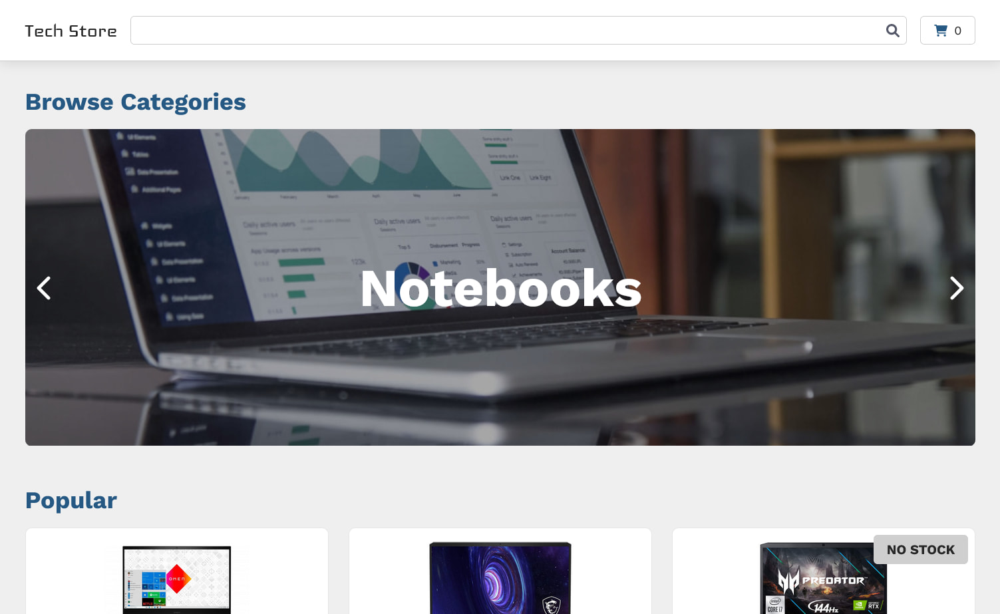
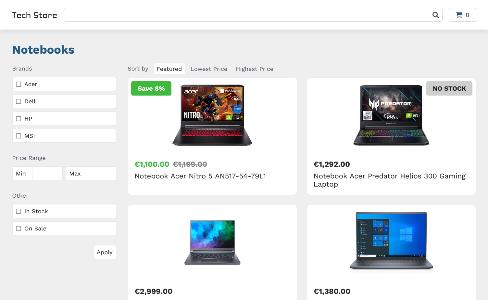
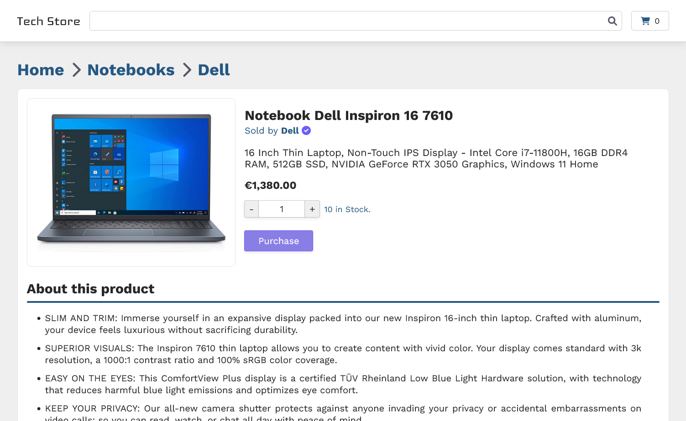

# Tech Store

Check out the [**Live Site**](https://tech-store-six.vercel.app/)!

## Screenshots

## Objective

My first e-commerce site built on Next.js, it takes advantage of Next's easy to use CSR and SSR for
better SEO. I decided to go for a GraphQL CMS (Hygraph) instead of REST to learn more about the use
and implementation of GraphQL. The products on the site are uploaded by me using Hygraph's web app
and on Next.js I use Apollo client to run the queries and get the data. And of course, stripe for
payments.

## Technical Overview

- Language: Typescript
- Built on Next.js using SSR for better SEO
- GraphQL for data fetching using Apollo client
- Uses [Hygraph](https://hygraph.com/) CMS to manage content
- Accept payments with [Stripe](https://stripe.com/) (test mode)
- Shopping cart persistence (local storage only)

## Features

- Product search
- Filters when browsing a specific category
- Add, remove and modify cart items
- Payments with stripe

## Compatibility

- Tested on desktop: Firefox, Chrome and Edge
- Tested on mobile: Firefox, Chrome

## Comments

I used the built-in CSS support in Next.js (the `*.module.css` files) but I would probably change
it for something else, or at least use it with SASS.
